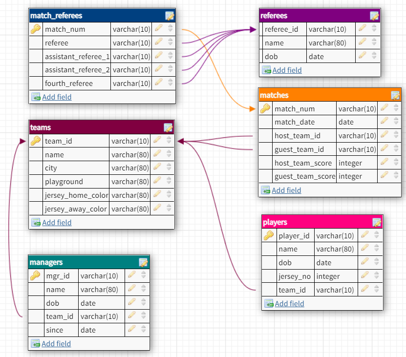

## Question 3
Q004flisdb: Write an SQL statement to find the team ID of teams that do not have players with jersey numbers (jersey_no) 77 or 88. flisdb:



### Solution:
```
SELECT team_id
FROM teams
WHERE team_id NOT IN (SELECT team_id FROM players WHERE jersey_no IN (77,88));
```