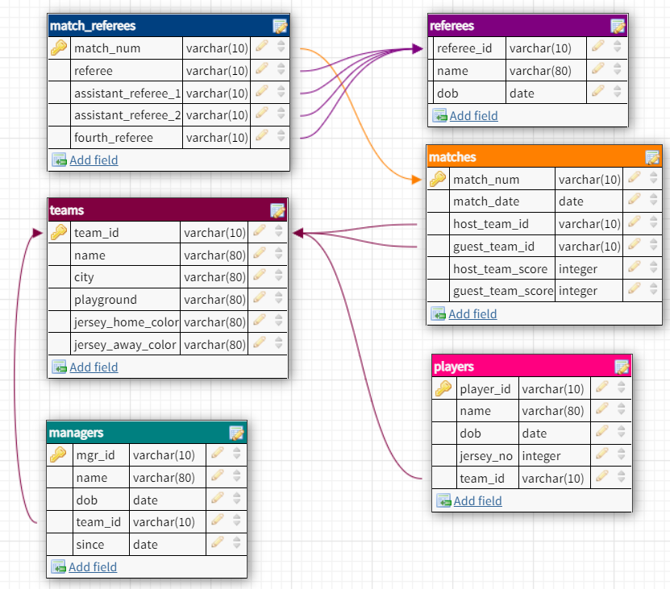
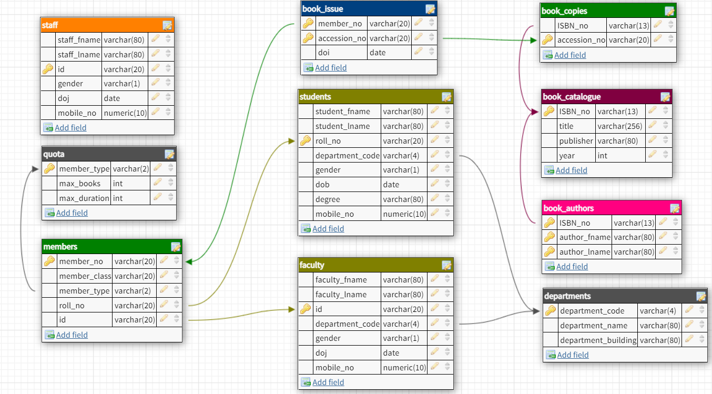

## Question 3
Q004flisdb: Write an SQL statement to find the team ID of teams that do not have players with jersey numbers (jersey_no) 77 or 88. flisdb:

## Question 3
Q004flisdb: Write an SQL statement to find the team ID of teams that do not have players with jersey numbers (jersey_no) 77 or 88. flisdb:



### Solution:
```
SELECT team_id
FROM teams
WHERE team_id NOT IN (SELECT DISTINCT team_id FROM players WHERE jersey_no IN (77, 88));
```


## Question 4
Q005lisdb: Write an SQL statement to find department_code and member_type of the students who have issued (borrowed) books on '2021-08-02'. lisdb:



### Solution:
```
SELECT DISTINCT s.department_code, m.member_type
FROM students s
JOIN members m ON s.roll_no = m.roll_no
JOIN book_issue bi ON m.member_no = bi.member_no
WHERE bi.doi = '2021-08-02';
```


## Question 5
Q002lisdb: Write an SQL statement to find the book titles and the number of copies of the books which has the word 'Management' in their title.[Database: LIS] lisdb:


### Solution:
```
SELECT title, COUNT(*) AS copy_count
FROM book_catalogue
JOIN book_copies
ON book_catalogue.ISBN_no = book_copies.ISBN_no
WHERE title LIKE '%Management%'
GROUP BY title;
```